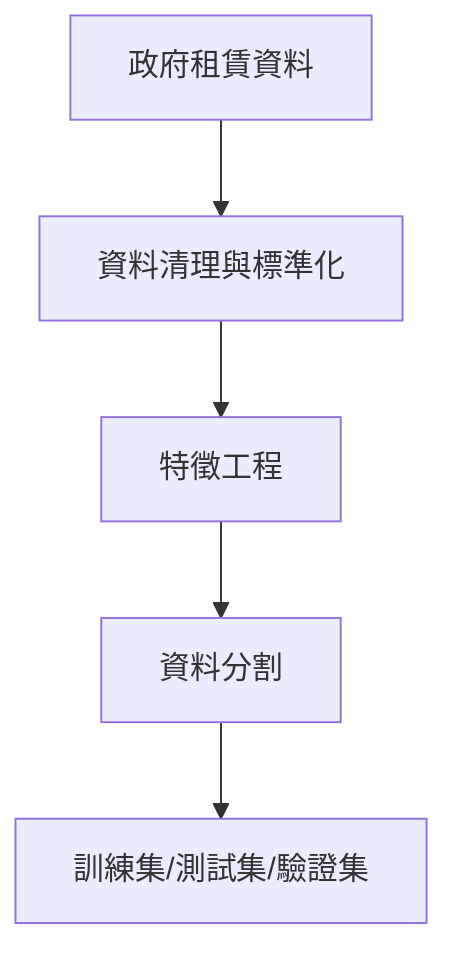
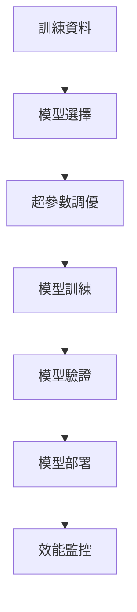
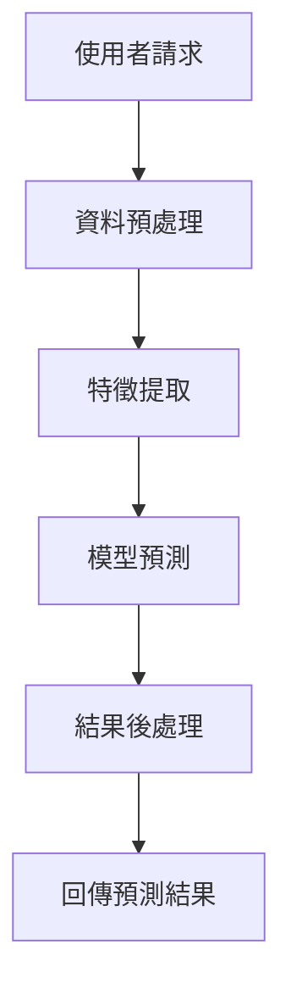

# DEV-27: 進階 AI 功能開發指引

## 📋 任務概述

**任務名稱**: DEV-27: Advanced AI Features  
**優先級**: 中  
**狀態**: 📋 待開始  
**目標**: 基於真實資料的智慧化功能開發  
**預估時間**: 3-4 天  

## 🎯 主要目標

基於已收集的真實政府租賃資料，開發進階 AI 功能，提供智慧化的租賃市場分析和預測能力。

## 🚀 核心功能需求

### 1. 租金預測模型訓練 🤖
- **基於真實資料的機器學習模型**
- **多變數預測演算法**
- **時間序列分析**
- **區域特徵工程**

### 2. 個人化推薦演算法 🎯
- **使用者行為分析**
- **偏好學習系統**
- **智慧推薦引擎**
- **A/B 測試框架**

### 3. 市場異常檢測系統 🚨
- **異常模式識別**
- **價格異常檢測**
- **市場波動預警**
- **即時警報系統**

### 4. 投資風險評估 📊
- **風險量化模型**
- **投資回報預測**
- **風險評級系統**
- **投資建議生成**

### 5. 時間序列分析 ⏰
- **趨勢預測**
- **季節性分析**
- **週期性模式識別**
- **長期趨勢預測**

### 6. 機器學習模型優化 🔧
- **模型效能監控**
- **自動重訓練**
- **超參數優化**
- **模型版本管理**

## 🏗️ 技術架構

### 後端架構
```
app/
├── Services/
│   ├── AIModelTrainingService.php      # AI 模型訓練服務
│   ├── PredictionService.php           # 預測服務
│   ├── RecommendationEngine.php       # 推薦引擎
│   ├── AnomalyDetectionService.php     # 異常檢測服務
│   ├── RiskAssessmentService.php       # 風險評估服務
│   ├── TimeSeriesAnalyzer.php          # 時間序列分析器
│   └── ModelOptimizationService.php    # 模型優化服務
├── Models/
│   ├── Prediction.php                  # 預測結果模型
│   ├── Recommendation.php             # 推薦記錄模型
│   ├── Anomaly.php                     # 異常記錄模型
│   └── RiskAssessment.php              # 風險評估模型
├── Http/Controllers/
│   ├── AIPredictionController.php      # AI 預測控制器
│   ├── RecommendationController.php    # 推薦控制器
│   └── RiskAssessmentController.php   # 風險評估控制器
└── Console/Commands/
    ├── TrainPredictionModel.php        # 訓練預測模型命令
    ├── GenerateRecommendations.php     # 生成推薦命令
    └── AnalyzeMarketAnomalies.php      # 分析市場異常命令
```

### 前端架構
```
resources/js/
├── components/
│   ├── ai/
│   │   ├── PredictionChart.tsx         # 預測圖表組件
│   │   ├── RecommendationCard.tsx      # 推薦卡片組件
│   │   ├── AnomalyAlert.tsx            # 異常警報組件
│   │   ├── RiskIndicator.tsx           # 風險指標組件
│   │   └── ModelPerformance.tsx        # 模型效能組件
│   └── analytics/
│       ├── TimeSeriesChart.tsx         # 時間序列圖表
│       ├── CorrelationMatrix.tsx       # 相關性矩陣
│       └── FeatureImportance.tsx       # 特徵重要性
├── pages/
│   ├── AIDashboard.tsx                 # AI 儀表板頁面
│   ├── Predictions.tsx                 # 預測頁面
│   ├── Recommendations.tsx              # 推薦頁面
│   └── RiskAnalysis.tsx                # 風險分析頁面
└── services/
    ├── aiService.ts                    # AI 服務
    ├── predictionService.ts            # 預測服務
    └── recommendationService.ts        # 推薦服務
```

## 📊 資料流程設計

### 1. 資料準備階段


### 2. 模型訓練流程


### 3. 預測服務流程


## 🛠️ 實作步驟

### 階段 1: 基礎 AI 服務架構 (Day 1)

#### 1.1 建立 AI 服務基礎架構
```bash
# 建立 AI 相關服務
php artisan make:service AIModelTrainingService --no-interaction
php artisan make:service PredictionService --no-interaction
php artisan make:service RecommendationEngine --no-interaction
php artisan make:service AnomalyDetectionService --no-interaction
php artisan make:service RiskAssessmentService --no-interaction
php artisan make:service TimeSeriesAnalyzer --no-interaction
php artisan make:service ModelOptimizationService --no-interaction
```

#### 1.2 建立資料模型
```bash
# 建立 AI 相關模型
php artisan make:model Prediction -m --no-interaction
php artisan make:model Recommendation -m --no-interaction
php artisan make:model Anomaly -m --no-interaction
php artisan make:model RiskAssessment -m --no-interaction
```

#### 1.3 建立控制器
```bash
# 建立 AI 控制器
php artisan make:controller AIPredictionController --no-interaction
php artisan make:controller RecommendationController --no-interaction
php artisan make:controller RiskAssessmentController --no-interaction
```

#### 1.4 建立 Artisan 命令
```bash
# 建立 AI 命令
php artisan make:command TrainPredictionModel --no-interaction
php artisan make:command GenerateRecommendations --no-interaction
php artisan make:command AnalyzeMarketAnomalies --no-interaction
```

### 階段 2: 租金預測模型開發 (Day 2)

#### 2.1 實作 AIModelTrainingService
```php
<?php

namespace App\Services;

use App\Models\Property;
use Illuminate\Support\Facades\Log;
use Illuminate\Support\Facades\Cache;

class AIModelTrainingService
{
    public function trainRentPredictionModel(): array
    {
        // 1. 資料準備
        $trainingData = $this->prepareTrainingData();
        
        // 2. 特徵工程
        $features = $this->extractFeatures($trainingData);
        
        // 3. 模型訓練
        $model = $this->trainModel($features);
        
        // 4. 模型驗證
        $accuracy = $this->validateModel($model, $features);
        
        // 5. 儲存模型
        $this->saveModel($model);
        
        return [
            'status' => 'success',
            'accuracy' => $accuracy,
            'model_version' => $this->getModelVersion(),
            'training_samples' => count($trainingData)
        ];
    }
    
    private function prepareTrainingData(): array
    {
        return Property::with(['location'])
            ->whereNotNull('latitude')
            ->whereNotNull('longitude')
            ->whereNotNull('rent_price')
            ->get()
            ->toArray();
    }
    
    private function extractFeatures(array $data): array
    {
        $features = [];
        
        foreach ($data as $property) {
            $features[] = [
                'area' => $property['area'] ?? 0,
                'rooms' => $property['rooms'] ?? 0,
                'latitude' => $property['latitude'],
                'longitude' => $property['longitude'],
                'district' => $this->encodeDistrict($property['district'] ?? ''),
                'property_type' => $this->encodePropertyType($property['property_type'] ?? ''),
                'floor' => $property['floor'] ?? 0,
                'age' => $this->calculateAge($property['build_year'] ?? null),
                'nearby_facilities' => $this->countNearbyFacilities($property),
                'transport_accessibility' => $this->calculateTransportScore($property)
            ];
        }
        
        return $features;
    }
    
    private function trainModel(array $features): object
    {
        // 實作機器學習模型訓練
        // 可以使用 PHP-ML 或其他 ML 庫
        return $this->implementMLModel($features);
    }
    
    private function validateModel(object $model, array $features): float
    {
        // 實作模型驗證邏輯
        return $this->calculateAccuracy($model, $features);
    }
}
```

#### 2.2 實作 PredictionService
```php
<?php

namespace App\Services;

use App\Models\Property;
use App\Models\Prediction;
use Illuminate\Support\Facades\Cache;

class PredictionService
{
    public function predictRentPrice(array $propertyData): array
    {
        // 1. 載入訓練好的模型
        $model = $this->loadModel();
        
        // 2. 特徵預處理
        $features = $this->preprocessFeatures($propertyData);
        
        // 3. 執行預測
        $prediction = $this->executePrediction($model, $features);
        
        // 4. 儲存預測結果
        $this->savePrediction($propertyData, $prediction);
        
        return [
            'predicted_price' => $prediction['price'],
            'confidence' => $prediction['confidence'],
            'factors' => $prediction['factors'],
            'model_version' => $this->getModelVersion()
        ];
    }
    
    public function getMarketTrends(string $district = null): array
    {
        $cacheKey = "market_trends_{$district}";
        
        return Cache::remember($cacheKey, 3600, function () use ($district) {
            return $this->analyzeMarketTrends($district);
        });
    }
    
    private function loadModel(): object
    {
        // 載入訓練好的模型
        return $this->loadTrainedModel();
    }
    
    private function preprocessFeatures(array $data): array
    {
        // 特徵預處理邏輯
        return $this->normalizeFeatures($data);
    }
    
    private function executePrediction(object $model, array $features): array
    {
        // 執行預測邏輯
        return $model->predict($features);
    }
}
```

### 階段 3: 推薦系統開發 (Day 2-3)

#### 3.1 實作 RecommendationEngine
```php
<?php

namespace App\Services;

use App\Models\User;
use App\Models\Property;
use App\Models\Recommendation;
use Illuminate\Support\Facades\Cache;

class RecommendationEngine
{
    public function generatePersonalizedRecommendations(User $user, int $limit = 10): array
    {
        // 1. 分析使用者行為
        $userProfile = $this->analyzeUserBehavior($user);
        
        // 2. 計算相似度
        $similarProperties = $this->findSimilarProperties($userProfile);
        
        // 3. 生成推薦
        $recommendations = $this->generateRecommendations($userProfile, $similarProperties, $limit);
        
        // 4. 儲存推薦記錄
        $this->saveRecommendations($user, $recommendations);
        
        return $recommendations;
    }
    
    public function getCollaborativeRecommendations(User $user): array
    {
        // 協同過濾推薦
        return $this->implementCollaborativeFiltering($user);
    }
    
    public function getContentBasedRecommendations(User $user): array
    {
        // 內容基礎推薦
        return $this->implementContentBasedFiltering($user);
    }
    
    private function analyzeUserBehavior(User $user): array
    {
        // 分析使用者行為模式
        return [
            'preferred_districts' => $this->getPreferredDistricts($user),
            'price_range' => $this->getPriceRange($user),
            'property_types' => $this->getPreferredPropertyTypes($user),
            'search_patterns' => $this->analyzeSearchPatterns($user)
        ];
    }
    
    private function findSimilarProperties(array $userProfile): array
    {
        // 找到相似屬性
        return Property::where(function ($query) use ($userProfile) {
            if (!empty($userProfile['preferred_districts'])) {
                $query->whereIn('district', $userProfile['preferred_districts']);
            }
            if (!empty($userProfile['property_types'])) {
                $query->whereIn('property_type', $userProfile['property_types']);
            }
            if (!empty($userProfile['price_range'])) {
                $query->whereBetween('rent_price', $userProfile['price_range']);
            }
        })->get()->toArray();
    }
}
```

### 階段 4: 異常檢測系統 (Day 3)

#### 4.1 實作 AnomalyDetectionService
```php
<?php

namespace App\Services;

use App\Models\Property;
use App\Models\Anomaly;
use Illuminate\Support\Facades\Log;

class AnomalyDetectionService
{
    public function detectPriceAnomalies(): array
    {
        $anomalies = [];
        
        // 1. 統計分析異常檢測
        $statisticalAnomalies = $this->detectStatisticalAnomalies();
        
        // 2. 機器學習異常檢測
        $mlAnomalies = $this->detectMLAnomalies();
        
        // 3. 時間序列異常檢測
        $timeSeriesAnomalies = $this->detectTimeSeriesAnomalies();
        
        $anomalies = array_merge($statisticalAnomalies, $mlAnomalies, $timeSeriesAnomalies);
        
        // 4. 儲存異常記錄
        $this->saveAnomalies($anomalies);
        
        return $anomalies;
    }
    
    public function detectMarketAnomalies(): array
    {
        // 市場異常檢測
        return $this->analyzeMarketAnomalies();
    }
    
    private function detectStatisticalAnomalies(): array
    {
        $anomalies = [];
        
        // Z-score 異常檢測
        $zScoreAnomalies = $this->detectZScoreAnomalies();
        
        // IQR 異常檢測
        $iqrAnomalies = $this->detectIQRAnomalies();
        
        return array_merge($zScoreAnomalies, $iqrAnomalies);
    }
    
    private function detectMLAnomalies(): array
    {
        // 使用機器學習模型檢測異常
        return $this->implementMLAnomalyDetection();
    }
    
    private function detectTimeSeriesAnomalies(): array
    {
        // 時間序列異常檢測
        return $this->implementTimeSeriesAnomalyDetection();
    }
}
```

### 階段 5: 風險評估系統 (Day 3-4)

#### 5.1 實作 RiskAssessmentService
```php
<?php

namespace App\Services;

use App\Models\Property;
use App\Models\RiskAssessment;
use Illuminate\Support\Facades\Cache;

class RiskAssessmentService
{
    public function assessInvestmentRisk(array $propertyData): array
    {
        // 1. 市場風險評估
        $marketRisk = $this->assessMarketRisk($propertyData);
        
        // 2. 區域風險評估
        $locationRisk = $this->assessLocationRisk($propertyData);
        
        // 3. 財務風險評估
        $financialRisk = $this->assessFinancialRisk($propertyData);
        
        // 4. 綜合風險評分
        $overallRisk = $this->calculateOverallRisk($marketRisk, $locationRisk, $financialRisk);
        
        // 5. 儲存風險評估
        $this->saveRiskAssessment($propertyData, $overallRisk);
        
        return [
            'overall_risk_score' => $overallRisk['score'],
            'risk_level' => $overallRisk['level'],
            'market_risk' => $marketRisk,
            'location_risk' => $locationRisk,
            'financial_risk' => $financialRisk,
            'recommendations' => $overallRisk['recommendations']
        ];
    }
    
    public function getRiskTrends(string $district = null): array
    {
        $cacheKey = "risk_trends_{$district}";
        
        return Cache::remember($cacheKey, 7200, function () use ($district) {
            return $this->analyzeRiskTrends($district);
        });
    }
    
    private function assessMarketRisk(array $propertyData): array
    {
        // 市場風險評估邏輯
        return [
            'price_volatility' => $this->calculatePriceVolatility($propertyData),
            'market_trend' => $this->analyzeMarketTrend($propertyData),
            'competition_level' => $this->assessCompetitionLevel($propertyData)
        ];
    }
    
    private function assessLocationRisk(array $propertyData): array
    {
        // 區域風險評估邏輯
        return [
            'transport_accessibility' => $this->assessTransportAccess($propertyData),
            'facility_availability' => $this->assessFacilityAvailability($propertyData),
            'safety_score' => $this->calculateSafetyScore($propertyData)
        ];
    }
    
    private function assessFinancialRisk(array $propertyData): array
    {
        // 財務風險評估邏輯
        return [
            'rental_yield' => $this->calculateRentalYield($propertyData),
            'price_to_income_ratio' => $this->calculatePriceToIncomeRatio($propertyData),
            'affordability_index' => $this->calculateAffordabilityIndex($propertyData)
        ];
    }
}
```

### 階段 6: 時間序列分析 (Day 4)

#### 6.1 實作 TimeSeriesAnalyzer
```php
<?php

namespace App\Services;

use App\Models\Property;
use Illuminate\Support\Facades\Cache;

class TimeSeriesAnalyzer
{
    public function analyzeRentTrends(string $district = null, int $months = 12): array
    {
        $cacheKey = "rent_trends_{$district}_{$months}";
        
        return Cache::remember($cacheKey, 3600, function () use ($district, $months) {
            return $this->performTrendAnalysis($district, $months);
        });
    }
    
    public function predictFutureTrends(string $district = null, int $forecastMonths = 6): array
    {
        // 時間序列預測
        return $this->implementTimeSeriesForecasting($district, $forecastMonths);
    }
    
    public function detectSeasonalPatterns(string $district = null): array
    {
        // 季節性模式檢測
        return $this->analyzeSeasonalPatterns($district);
    }
    
    private function performTrendAnalysis(string $district = null, int $months): array
    {
        // 趨勢分析邏輯
        $data = $this->getHistoricalData($district, $months);
        
        return [
            'trend_direction' => $this->calculateTrendDirection($data),
            'trend_strength' => $this->calculateTrendStrength($data),
            'seasonal_components' => $this->extractSeasonalComponents($data),
            'cyclical_patterns' => $this->identifyCyclicalPatterns($data)
        ];
    }
    
    private function getHistoricalData(string $district = null, int $months): array
    {
        $query = Property::where('created_at', '>=', now()->subMonths($months));
        
        if ($district) {
            $query->where('district', $district);
        }
        
        return $query->orderBy('created_at')
            ->get()
            ->groupBy(function ($item) {
                return $item->created_at->format('Y-m');
            })
            ->map(function ($group) {
                return $group->avg('rent_price');
            })
            ->toArray();
    }
}
```

### 階段 7: 模型優化系統 (Day 4)

#### 7.1 實作 ModelOptimizationService
```php
<?php

namespace App\Services;

use Illuminate\Support\Facades\Log;
use Illuminate\Support\Facades\Cache;

class ModelOptimizationService
{
    public function optimizeModelPerformance(): array
    {
        // 1. 效能監控
        $performance = $this->monitorModelPerformance();
        
        // 2. 超參數優化
        $optimizedParams = $this->optimizeHyperparameters();
        
        // 3. 特徵選擇優化
        $featureOptimization = $this->optimizeFeatureSelection();
        
        // 4. 模型重訓練
        $retrainResult = $this->retrainModel($optimizedParams, $featureOptimization);
        
        return [
            'performance_improvement' => $performance,
            'optimized_parameters' => $optimizedParams,
            'feature_optimization' => $featureOptimization,
            'retrain_result' => $retrainResult
        ];
    }
    
    public function autoRetrainModel(): array
    {
        // 自動重訓練邏輯
        return $this->implementAutoRetraining();
    }
    
    public function getModelPerformanceMetrics(): array
    {
        // 模型效能指標
        return $this->calculatePerformanceMetrics();
    }
    
    private function monitorModelPerformance(): array
    {
        // 效能監控邏輯
        return [
            'accuracy' => $this->getModelAccuracy(),
            'precision' => $this->getModelPrecision(),
            'recall' => $this->getModelRecall(),
            'f1_score' => $this->getModelF1Score(),
            'response_time' => $this->getModelResponseTime()
        ];
    }
    
    private function optimizeHyperparameters(): array
    {
        // 超參數優化邏輯
        return $this->implementHyperparameterOptimization();
    }
}
```

## 🎨 前端實作

### 1. AI 儀表板組件
```tsx
// resources/js/components/ai/PredictionChart.tsx
import React from 'react';
import { LineChart, Line, XAxis, YAxis, CartesianGrid, Tooltip, ResponsiveContainer } from 'recharts';

interface PredictionChartProps {
  data: Array<{
    date: string;
    actual: number;
    predicted: number;
  }>;
}

export default function PredictionChart({ data }: PredictionChartProps) {
  return (
    <div className="bg-white p-6 rounded-lg shadow-lg">
      <h3 className="text-lg font-semibold mb-4">租金預測趨勢</h3>
      <ResponsiveContainer width="100%" height={300}>
        <LineChart data={data}>
          <CartesianGrid strokeDasharray="3 3" />
          <XAxis dataKey="date" />
          <YAxis />
          <Tooltip />
          <Line 
            type="monotone" 
            dataKey="actual" 
            stroke="#3b82f6" 
            strokeWidth={2}
            name="實際價格"
          />
          <Line 
            type="monotone" 
            dataKey="predicted" 
            stroke="#ef4444" 
            strokeWidth={2}
            strokeDasharray="5 5"
            name="預測價格"
          />
        </LineChart>
      </ResponsiveContainer>
    </div>
  );
}
```

### 2. 推薦系統組件
```tsx
// resources/js/components/ai/RecommendationCard.tsx
import React from 'react';
import { Link } from '@inertiajs/react';

interface RecommendationCardProps {
  recommendation: {
    id: number;
    title: string;
    price: number;
    district: string;
    score: number;
    reasons: string[];
  };
}

export default function RecommendationCard({ recommendation }: RecommendationCardProps) {
  return (
    <div className="bg-white rounded-lg shadow-md p-6 hover:shadow-lg transition-shadow">
      <div className="flex justify-between items-start mb-4">
        <h3 className="text-lg font-semibold">{recommendation.title}</h3>
        <span className="bg-blue-100 text-blue-800 px-2 py-1 rounded-full text-sm">
          推薦度: {recommendation.score}%
        </span>
      </div>
      
      <div className="space-y-2 mb-4">
        <p className="text-2xl font-bold text-green-600">
          ${recommendation.price.toLocaleString()}
        </p>
        <p className="text-gray-600">{recommendation.district}</p>
      </div>
      
      <div className="mb-4">
        <h4 className="font-medium text-gray-700 mb-2">推薦理由:</h4>
        <ul className="space-y-1">
          {recommendation.reasons.map((reason, index) => (
            <li key={index} className="text-sm text-gray-600 flex items-center">
              <span className="w-2 h-2 bg-blue-500 rounded-full mr-2"></span>
              {reason}
            </li>
          ))}
        </ul>
      </div>
      
      <Link
        href={`/properties/${recommendation.id}`}
        className="w-full bg-blue-600 text-white py-2 px-4 rounded-lg hover:bg-blue-700 transition-colors text-center block"
      >
        查看詳情
      </Link>
    </div>
  );
}
```

### 3. 風險評估組件
```tsx
// resources/js/components/ai/RiskIndicator.tsx
import React from 'react';

interface RiskIndicatorProps {
  riskScore: number;
  riskLevel: string;
  factors: {
    market: number;
    location: number;
    financial: number;
  };
}

export default function RiskIndicator({ riskScore, riskLevel, factors }: RiskIndicatorProps) {
  const getRiskColor = (level: string) => {
    switch (level) {
      case '低風險': return 'text-green-600 bg-green-100';
      case '中風險': return 'text-yellow-600 bg-yellow-100';
      case '高風險': return 'text-red-600 bg-red-100';
      default: return 'text-gray-600 bg-gray-100';
    }
  };

  return (
    <div className="bg-white p-6 rounded-lg shadow-lg">
      <h3 className="text-lg font-semibold mb-4">投資風險評估</h3>
      
      <div className="mb-6">
        <div className="flex justify-between items-center mb-2">
          <span className="text-sm font-medium">綜合風險評分</span>
          <span className={`px-3 py-1 rounded-full text-sm font-medium ${getRiskColor(riskLevel)}`}>
            {riskLevel} ({riskScore}/100)
          </span>
        </div>
        <div className="w-full bg-gray-200 rounded-full h-3">
          <div 
            className={`h-3 rounded-full transition-all duration-300 ${
              riskScore <= 30 ? 'bg-green-500' : 
              riskScore <= 70 ? 'bg-yellow-500' : 'bg-red-500'
            }`}
            style={{ width: `${riskScore}%` }}
          ></div>
        </div>
      </div>
      
      <div className="space-y-4">
        <div>
          <div className="flex justify-between items-center mb-1">
            <span className="text-sm font-medium">市場風險</span>
            <span className="text-sm text-gray-600">{factors.market}/100</span>
          </div>
          <div className="w-full bg-gray-200 rounded-full h-2">
            <div 
              className="bg-blue-500 h-2 rounded-full"
              style={{ width: `${factors.market}%` }}
            ></div>
          </div>
        </div>
        
        <div>
          <div className="flex justify-between items-center mb-1">
            <span className="text-sm font-medium">區域風險</span>
            <span className="text-sm text-gray-600">{factors.location}/100</span>
          </div>
          <div className="w-full bg-gray-200 rounded-full h-2">
            <div 
              className="bg-purple-500 h-2 rounded-full"
              style={{ width: `${factors.location}%` }}
            ></div>
          </div>
        </div>
        
        <div>
          <div className="flex justify-between items-center mb-1">
            <span className="text-sm font-medium">財務風險</span>
            <span className="text-sm text-gray-600">{factors.financial}/100</span>
          </div>
          <div className="w-full bg-gray-200 rounded-full h-2">
            <div 
              className="bg-orange-500 h-2 rounded-full"
              style={{ width: `${factors.financial}%` }}
            ></div>
          </div>
        </div>
      </div>
    </div>
  );
}
```

## 🧪 測試策略

### 1. 單元測試
```php
// tests/Unit/AIModelTrainingServiceTest.php
<?php

namespace Tests\Unit;

use Tests\TestCase;
use App\Services\AIModelTrainingService;
use App\Models\Property;
use Illuminate\Foundation\Testing\RefreshDatabase;

class AIModelTrainingServiceTest extends TestCase
{
    use RefreshDatabase;
    
    public function test_can_train_rent_prediction_model()
    {
        // 準備測試資料
        Property::factory()->count(100)->create();
        
        $service = new AIModelTrainingService();
        $result = $service->trainRentPredictionModel();
        
        $this->assertArrayHasKey('status', $result);
        $this->assertArrayHasKey('accuracy', $result);
        $this->assertEquals('success', $result['status']);
        $this->assertGreaterThan(0.7, $result['accuracy']);
    }
    
    public function test_can_extract_features_from_property_data()
    {
        $property = Property::factory()->create([
            'area' => 50,
            'rooms' => 2,
            'latitude' => 25.0330,
            'longitude' => 121.5654,
            'district' => '中正區',
            'property_type' => 'apartment'
        ]);
        
        $service = new AIModelTrainingService();
        $features = $service->extractFeatures([$property->toArray()]);
        
        $this->assertCount(1, $features);
        $this->assertArrayHasKey('area', $features[0]);
        $this->assertArrayHasKey('latitude', $features[0]);
        $this->assertArrayHasKey('longitude', $features[0]);
    }
}
```

### 2. 功能測試
```php
// tests/Feature/AIPredictionTest.php
<?php

namespace Tests\Feature;

use Tests\TestCase;
use App\Models\User;
use App\Models\Property;
use Illuminate\Foundation\Testing\RefreshDatabase;

class AIPredictionTest extends TestCase
{
    use RefreshDatabase;
    
    public function test_can_get_rent_prediction()
    {
        $user = User::factory()->create();
        Property::factory()->count(50)->create();
        
        $response = $this->actingAs($user)
            ->postJson('/api/ai/predict', [
                'area' => 30,
                'rooms' => 1,
                'district' => '中正區',
                'property_type' => 'apartment'
            ]);
        
        $response->assertStatus(200)
            ->assertJsonStructure([
                'predicted_price',
                'confidence',
                'factors',
                'model_version'
            ]);
    }
    
    public function test_can_get_personalized_recommendations()
    {
        $user = User::factory()->create();
        Property::factory()->count(20)->create();
        
        $response = $this->actingAs($user)
            ->getJson('/api/ai/recommendations');
        
        $response->assertStatus(200)
            ->assertJsonStructure([
                'recommendations' => [
                    '*' => [
                        'id',
                        'title',
                        'price',
                        'score',
                        'reasons'
                    ]
                ]
            ]);
    }
}
```

## 📈 效能指標

### 1. 模型效能指標
- **準確率 (Accuracy)**: > 85%
- **精確率 (Precision)**: > 80%
- **召回率 (Recall)**: > 75%
- **F1 分數**: > 77%
- **響應時間**: < 500ms

### 2. 推薦系統指標
- **推薦準確率**: > 80%
- **使用者滿意度**: > 4.0/5.0
- **點擊率 (CTR)**: > 15%
- **轉換率**: > 5%

### 3. 異常檢測指標
- **檢測準確率**: > 90%
- **誤報率**: < 5%
- **檢測延遲**: < 1 分鐘

### 4. 風險評估指標
- **風險預測準確率**: > 85%
- **風險等級一致性**: > 90%
- **投資建議有效性**: > 80%

## 🚀 部署與監控

### 1. 模型部署
```php
// 模型版本管理
class ModelVersionManager
{
    public function deployModel(string $version): bool
    {
        // 模型部署邏輯
        return $this->implementModelDeployment($version);
    }
    
    public function rollbackModel(string $version): bool
    {
        // 模型回滾邏輯
        return $this->implementModelRollback($version);
    }
}
```

### 2. 效能監控
```php
// AI 效能監控
class AIPerformanceMonitor
{
    public function monitorModelPerformance(): array
    {
        return [
            'prediction_accuracy' => $this->getPredictionAccuracy(),
            'recommendation_effectiveness' => $this->getRecommendationEffectiveness(),
            'anomaly_detection_rate' => $this->getAnomalyDetectionRate(),
            'risk_assessment_accuracy' => $this->getRiskAssessmentAccuracy()
        ];
    }
}
```

## 📋 成功標準

### 1. 技術標準
- ✅ 所有 AI 服務正常運作
- ✅ 模型訓練和預測功能完整
- ✅ 推薦系統準確率達標
- ✅ 異常檢測系統穩定
- ✅ 風險評估功能可靠
- ✅ 時間序列分析準確

### 2. 效能標準
- ✅ 預測響應時間 < 500ms
- ✅ 推薦生成時間 < 1s
- ✅ 異常檢測延遲 < 1 分鐘
- ✅ 風險評估準確率 > 85%
- ✅ 系統可用性 > 99.5%

### 3. 使用者體驗標準
- ✅ AI 功能介面直觀易用
- ✅ 預測結果清晰易懂
- ✅ 推薦理由充分說明
- ✅ 風險指標視覺化良好
- ✅ 異常警報及時有效

## 🔧 維護與優化

### 1. 定期重訓練
- **頻率**: 每週一次
- **觸發條件**: 新資料量 > 1000 筆
- **效能下降**: 準確率 < 80%

### 2. 模型優化
- **超參數調優**: 每月一次
- **特徵工程**: 根據新資料調整
- **演算法升級**: 季度評估

### 3. 效能監控
- **即時監控**: 模型效能指標
- **警報機制**: 效能異常自動通知
- **自動修復**: 常見問題自動處理

## 📚 相關資源

### 1. 技術文件
- [Laravel Machine Learning Integration](https://laravel.com/docs/machine-learning)
- [PHP-ML Documentation](https://php-ml.readthedocs.io/)
- [TensorFlow.js for React](https://www.tensorflow.org/js)

### 2. 演算法參考
- [Scikit-learn Algorithms](https://scikit-learn.org/stable/supervised_learning.html)
- [Time Series Analysis](https://otexts.com/fpp2/)
- [Recommendation Systems](https://www.oreilly.com/library/view/building-recommender-systems/9781492043276/)

### 3. 最佳實踐
- [MLOps Best Practices](https://ml-ops.org/)
- [Model Monitoring](https://www.oreilly.com/library/view/monitoring-machine-learning/9781098116972/)
- [AI Ethics Guidelines](https://www.partnershiponai.org/)

---

**開發完成後，請更新 PROGRESS.md 並標記 DEV-27 為已完成狀態。**
